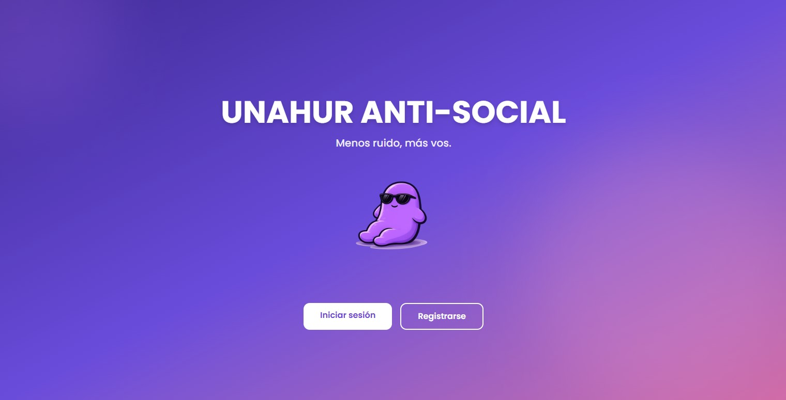
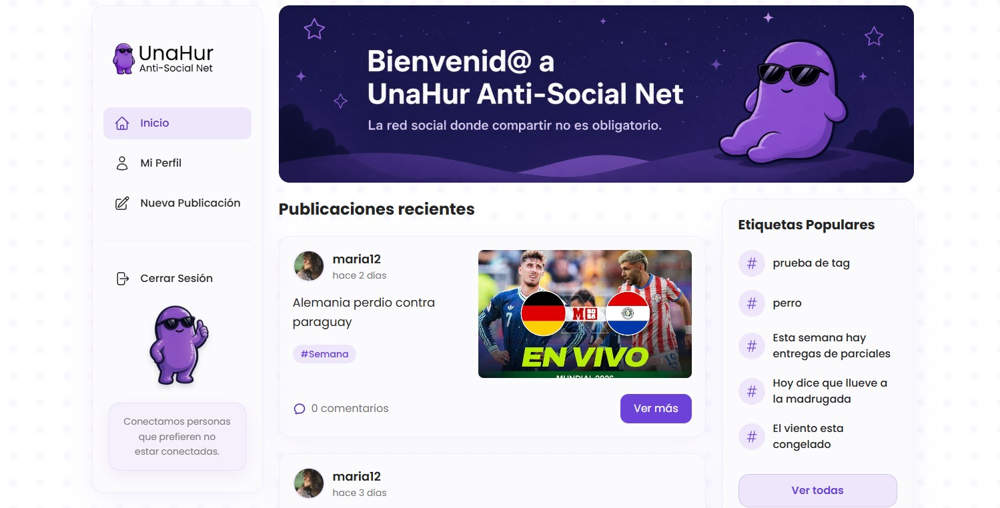
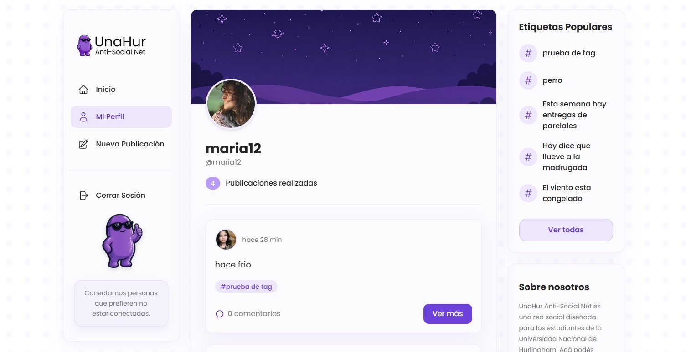
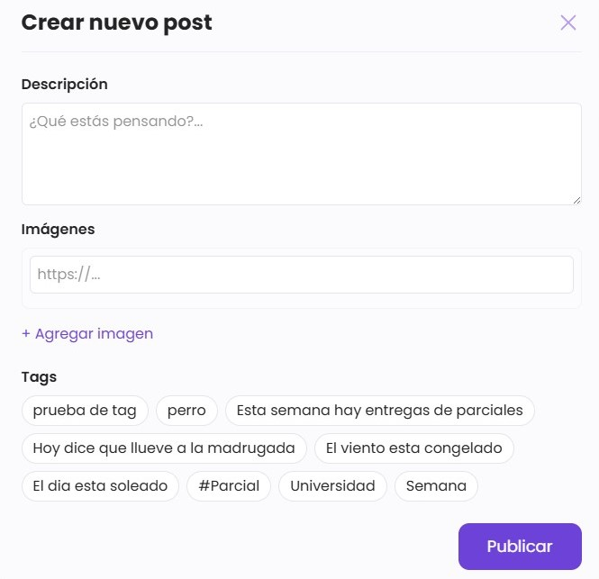
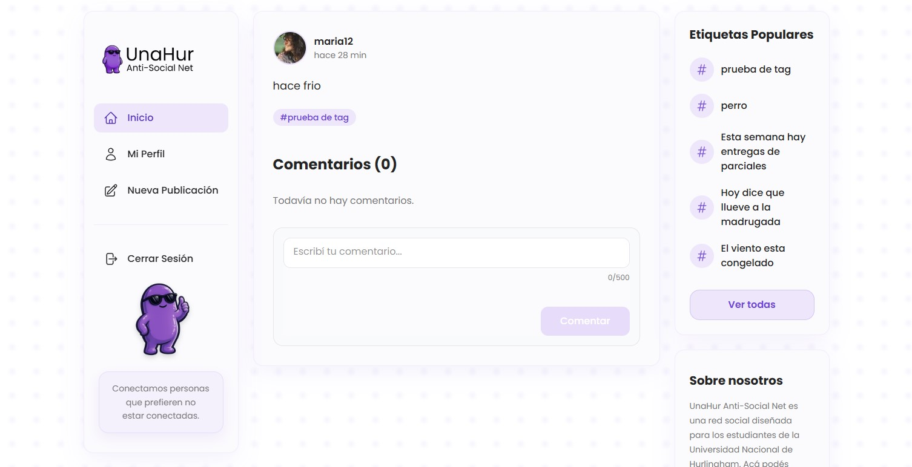

# Descripción
UnaHur Anti-Social Net es una red social diseñada exclusivamente
para los estudiantes de la Universidad Nacional de Hurlingham. 
Aquí podés compartir publicaciones, hacer consultas, intercambiar
apuntes, debatir sobre materias, recomendar recursos y conectar con
otros estudiantes de la comunidad

## Tecnologías Utilizadas
- React
- TypeScript
- Vite
- Tailwind CSS
- React Router DOM
- React Icons
- ESLint

## Instalación y Ejecución
1. Clonar el repositorio:
```bash
git clone https://github.com/gonnbar/tp2-ciu1c2026-aagp.git
```
2. Ingresar al directorio del proyecto:
``` bash 
cd tp2-ciu1c2026-aagp
```
3. Instalar las dependencias:
``` bash
npm i
```
4. Ejecutar el proyecto en modo desarrollo:
``` bash
npm run dev
```
5. Abrir en el navegador la siguiente URL
``` bash
http://localhost:5173
```
### Instalación y Ejecución (backend utilizado: https://github.com/gonnbar/tp2-ciu1c2026-aagp-backend )

1. Clonar el repositorio:
```bash
git clone https://github.com/gonnbar/tp2-ciu1c2026-aagp-backend.git
```
2. Ingresar al directorio del proyecto:
```bash
cd tp2-ciu1c2026-aagp-backend
```
3. Instalar las dependencias:
```bash
npm i
```
4. Inicializar contenedores de docker:

```bash
docker compose up -d
```
5. Ejecutar el proyecto en modo desarrollo:
```bash
npm run dev
```

## Funcionalidades
* Visualización de pagina de bienvenida.
* Formulario de registro con validaciones.
* Formulario de login con validaciones.
* Visualización de publicaciones recientes.
* Vista detalle de cada publicacion.
* Creación de nuevas publicaciones con imágenes y etiquetas.
* Visualización de perfil
## Estructura
```text
.
├── public
│   ├── favicon.svg
│   └── icons.svg
├── src
│   ├── assets
│   │   ├── bannerCel.png
│   │   ├── bannerDesktop.png
|   |   ├── banner_abt.png
|   |   ├── banner_abt_mb.png
│   │   ├── banner_profile.png
│   │   ├── logoBienvenida.png
│   │   ├── logo.png
|   |   ├── personaje_sb.png
│   │   └── sideBarImg.png
│   ├── components
│   │   ├── CommentForm
│   │   │   └── CommentForm.tsx
│   │   ├── CommentList
│   │   │   └── CommentList.tsx
│   │   ├── ImageCarousel
│   │   │   └── ImageCarousel.tsx
│   │   ├── Layout
│   │   │   └── Layout.tsx
│   │   ├── Loading
│   │   │   └── Loading.tsx
│   │   ├── MobileBottomNav
│   │   │   └── MobileBottomNav.tsx
│   │   ├── PanelDerecho
│   │   │   └── PanelDerecho.tsx
│   │   ├── PasswordInput
│   │   │   └── PasswordInput.tsx
│   │   ├── PostCard
│   │   │   └── PostCard.tsx
│   │   ├── ScrollToTopButton
│   │   │   └── ScrollToTopButton.tsx
│   │   ├── SideBar
│   │   │   └── SideBar.tsx
│   │   └── Toast
│   │       └── Toast.tsx
│   ├── context
│   │   ├── ToastContext.tsx
│   │   └── UserContext.tsx
│   ├── pages
│   │   ├── About.tsx
│   │   ├── CreatePost.tsx
│   │   ├── ForgotPass.tsx
│   │   ├── Home.tsx
│   │   ├── Login.tsx
│   │   ├── PostDetail.tsx
│   │   ├── Profile.tsx
│   │   ├── Register.tsx
│   │   └── Welcome.tsx
│   ├── routes
│   │   └── ProtectedRoute.tsx
│   ├── services
│   │   ├── comments.ts
│   │   ├── config.ts
│   │   ├── posts.ts
│   │   ├── profile.ts
│   │   └── tags.ts
│   ├── types
│   │   ├── Comment.ts
│   │   ├── Image.ts
│   │   ├── Post.ts
│   │   ├── Profile.ts
│   │   ├── Tag.ts
│   │   └── User.ts
│   ├── utils
│   │   ├── avatar.ts
│   │   └── date.ts
│   ├── validaciones
│   │   └── validacion.ts
│   ├── App.css
│   ├── App.tsx
│   ├── index.css
│   └── main.tsx
├── eslint.config.js
├── .gitignore
├── index.html
├── package.json
├── package-lock.json
├── README.md
├── tsconfig.app.json
├── tsconfig.json
├── tsconfig.node.json
└── vite.config.ts
```
## Screenshots

## Pagina de bienvenida

## Login

## Registro

## Home

## Mi perfil

## Nueva publicación

## Detalle publicación

## Integrantes

| Nombre | GitHub |
|------------|---------|
| Avila, Paz Maria | https://github.com/pazm-avila |
| Barbosa, Gonzalo Nicolas | https://github.com/gonnbar |
| Peralta, Melanie Ailen | https://github.com/ailenperalta |
| Rodriguez, Ana Paula | https://github.com/anapauula1 |

